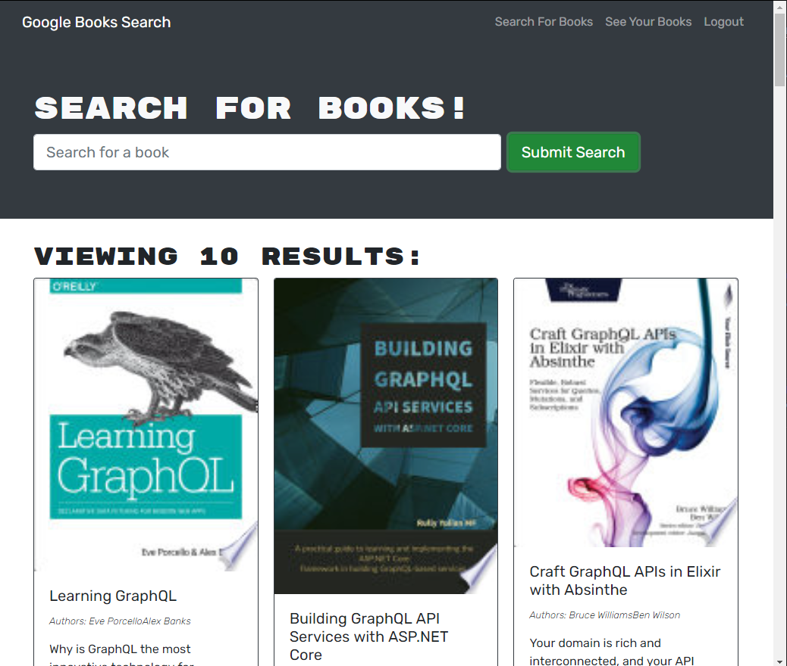

# BookSearch
MERN app where users can search for books and save a list of thier choice of books. 

[](https://opensource.org/licenses/MIT) 
## Description: 
This is an application that you can use to search for books and save the ones you'd like in a list that can be viewed later.  You can also delete the books in your stored list to keep it up to date. This application uses Node.js, an Express server, Mongoose, Apollo and Graphql. You can install and run on a local server, or use the deployed version.     
## Table of Contents: 
* [Installation](#installation)
* [Usage](#usage) 
* [License](#license) 
* [Contributing](#contributing) 
* [Questions](#questions) 
## Installation: 
[Click here for deployed app](https://searchandsavegooglebooks.herokuapp.com//)   
   
Or to run locally:

* You will need to have Node.js and MongoDB installed. 
* After cloning the repo, run ```npm install``` in your bash terminal to install the dependencies.  Then run ```npm install graphql```
* Be sure to log into mongod. 
* Run ```npm run develop``` to initialize both the front and back end servers on your local machine, then go to localhost:3000 in your browser. 


 
## Usage: 
The homepage will display a search bar where you can search for a book.  You can search for books, but in order to save them to your personal list you will need to sign up or login, see the links in the nav bar on upper right.  Once logged in, you can click the "Save this Book!" button below any book in the search results to add it to your list of saved books.  To see the books you have saved, click on "See Your Books" on the upper right nav bar.  You can use the "Delete this Book!" button to remove any books from your saved list.  




## License: 
Licensed under the [MIT](https://opensource.org/licenses/MIT) license. 
## Contributing: 
Feel free to contact me to contribute to this project. My contact information is listed below.

## Questions: 
GitHub: [melinamboedecker](https://github.com/melinamboedecker) 

If you have any additional questions, please contact me at melinamboedecker@gmail.com. 
